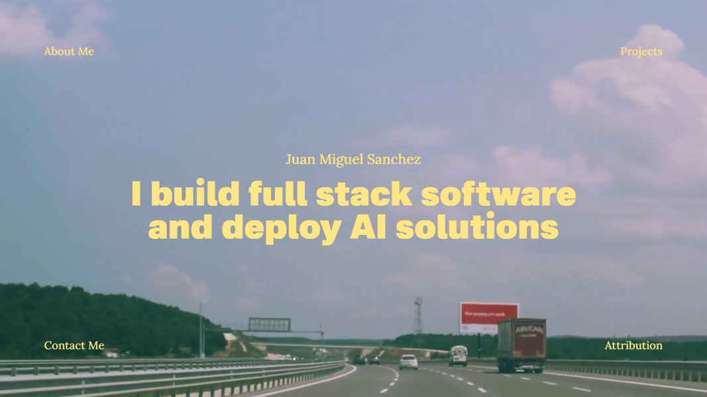

# Juan Miguel Sanchez - Portfolio

[](mailto:your-email@example.com)
[](https://your-portfolio-url.com)

## 👋 About Me

I'm a Full Stack Software Developer passionate about building scalable applications and deploying cutting-edge AI/LLM solutions. I specialize in creating modern, responsive web applications and implementing intelligent systems that solve real-world problems.

> **🟢 Currently Open to Work** - I'm actively seeking new opportunities in full stack development, AI/ML engineering, and software architecture roles.

## 🚀 What I Do

-   **Full Stack Development**: Building end-to-end web applications with modern frameworks
-   **AI Solutions**: Deploying and integrating AI/LLM models into production systems
-   **Software Architecture**: Designing scalable, maintainable systems
-   **Problem Solving**: Creating efficient solutions for complex technical challenges

## 💼 Portfolio



This portfolio showcases my projects, technical skills, and professional experience. Built with modern web technologies, it features:

-   **Responsive Design**: Optimized for all devices
-   **Interactive UI**: Smooth animations and engaging user experience
-   **Project Showcase**: Detailed case studies of my work
-   **Contact Integration**: Easy ways to get in touch

## 🛠️ Tech Stack

This portfolio is built with:

-   **Framework**: [Next.js 16](https://nextjs.org) (React 19)
-   **Language**: TypeScript
-   **Styling**: Tailwind CSS
-   **Deployment**: Vercel

## 📂 Project Structure

```
portfolio-five/
├── app/
│   ├── about/          # About me page
│   ├── projects/       # Projects showcase
│   ├── contact/        # Contact information
│   ├── assets/         # Static assets
│   └── components/     # Reusable components
├── public/             # Static assets
└── README.md           # You are here!
```

## 🚀 Getting Started

### Prerequisites

-   Node.js 20+ installed
-   npm, yarn, pnpm, or bun package manager

### Installation

1. Clone the repository:

```bash
git clone https://github.com/yourusername/portfolio-five.git
cd portfolio-five
```

2. Install dependencies:

```bash
npm install
# or
yarn install
# or
pnpm install
```

3. Run the development server:

```bash
npm run dev
# or
yarn dev
# or
pnpm dev
```

4. Open [http://localhost:3000](http://localhost:3000) in your browser

### Build for Production

```bash
npm run build
npm start
```

## 📫 Let's Connect

I'm always interested in discussing new opportunities, collaborations, or interesting projects!

-   **LinkedIn**: [linkedin.com/in/jmigsan](https://linkedin.com/in/jmigsan)
-   **GitHub**: [github.com/jmigsan](https://github.com/jmigsan)
-   **Portfolio**: [jmigsan.vercel.app](https://jmigsan.vercel.app/)
-   **CV**: [My CV](https://jmigsan.vercel.app/Juan%20Miguel%20Sanchez%20CV.pdf)

## 🤝 Open to Opportunities

I'm currently **open to work** and interested in:

-   ✅ Full-time positions
-   ✅ Contract work
-   ✅ Freelance projects
-   ✅ Consulting opportunities

**Preferred Roles**: Full Stack Developer, AI/ML Engineer, Software Engineer

**Location**: London / Open to relocation
